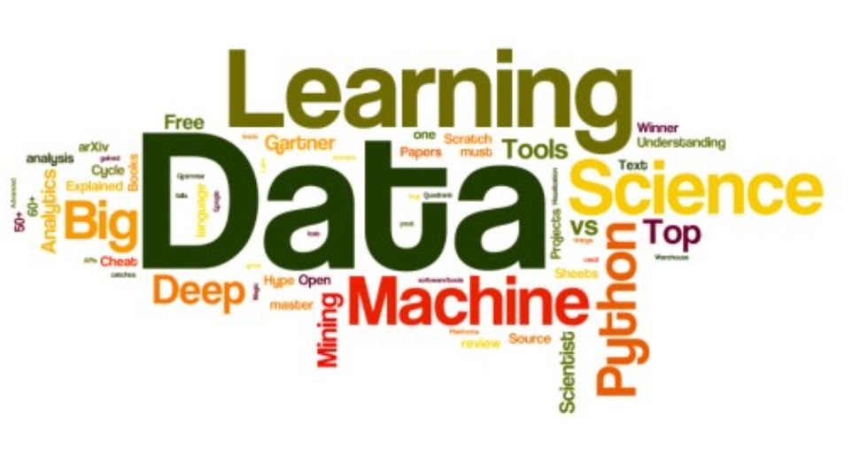

# 👋 Hi folks, my name is Alex Amaguaya.
### I'm a Economic Researcher, Data Analyst and Data Scientist.

I do data analytics in research papers and projects. Also, I'm open to new opportunities to advise companies on data analytics.

## Learn with me

🎁 Free Masterclass: [Revienta tu productividad en Android con Kotlin](https://devexperto.com/training-gratis?utm_source=github) / [Boost your Android productivity with Kotlin](https://antonioleiva.com/free-training)

🥉 Book: [Kotlin For Android Developers](https://antonioleiva.com/book) 
🥈 Training: [Kotlin Para Desarrolladores Android](https://devexperto.com/curso-kotlin-online) / [Kotlin for Android Developers](https://antonioleiva.com/online-course) 
🥇 Program: [Architect Coders](https://architectcoders.com)

## Skills:
 
 
 
 
 
 
 
 
 

## You can find me at.-

## Contact me:

