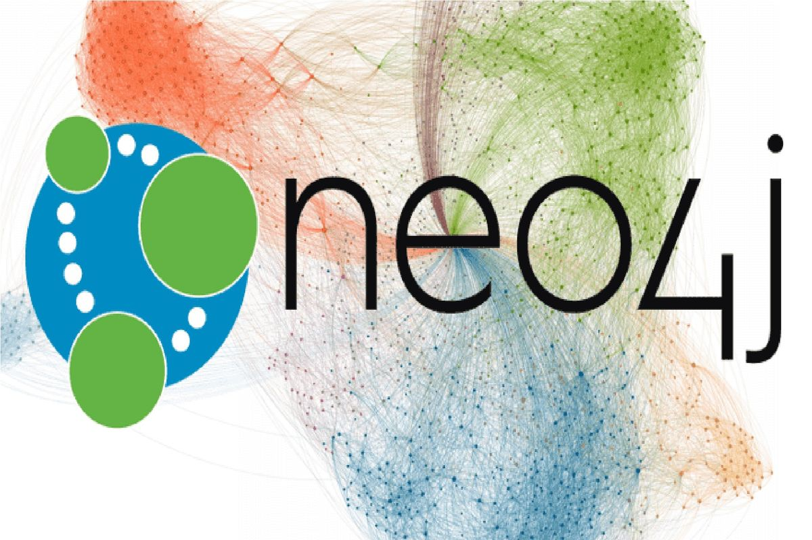

Hi 👋 My name is Alex
==============================

Data Scientist & Economic Researcher
------------------------------------

I work as a Data Scientist in a Business Intelligence company and usually collaborate in ESPOL research projects. I also have experience working with Social Media and Financial data. And I'm interested in developing research involving Econometrics and Machine Learning (intersection of fields).

* 🌍  I'm based in Ecuador
* 🖥️  See my portfolio at [Research Projects](http://alexamaguaya.netlify.app/publication/)
* ✉️  You can contact me at [alexamaguayap@gmail.com](mailto:alexamaguayap@gmail.com)
* 🚀  I'm currently working on [Nodel - Maven Road](http://mavenroad.com/)
* 🧠  I'm learning NLP, Bayesian Statistic, Algorithms.
* 🤝  I'm open to collaborating on ML/econometrics projects

### Skills

### Socials

        

### Badges

<b>My GitHub Stats</b>

### Support Me

